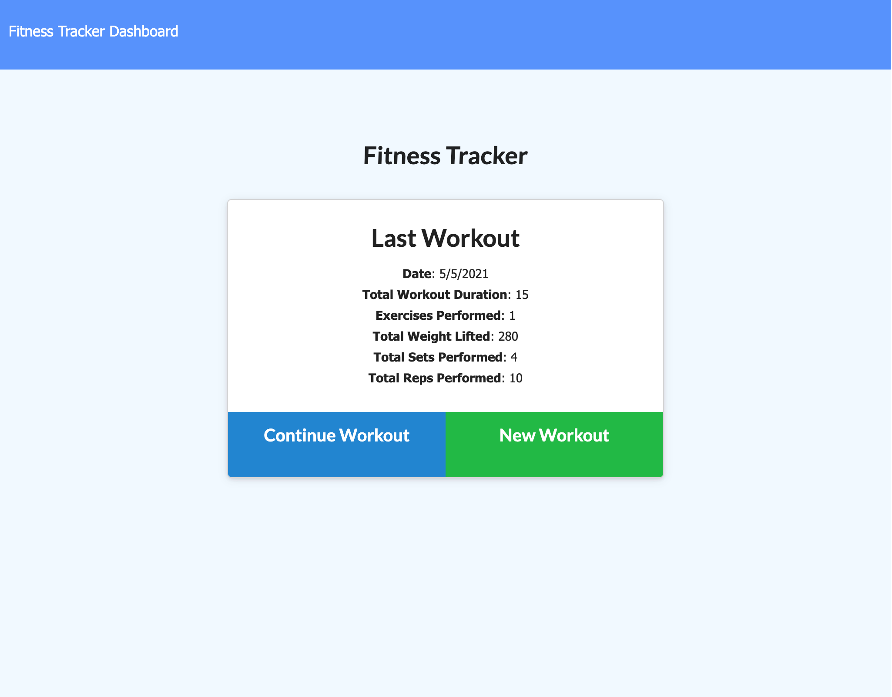
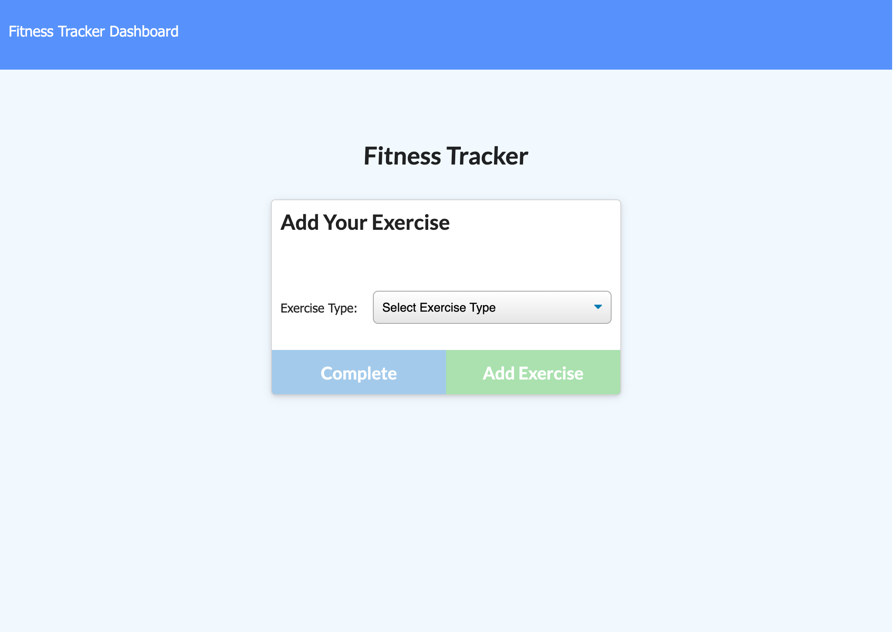
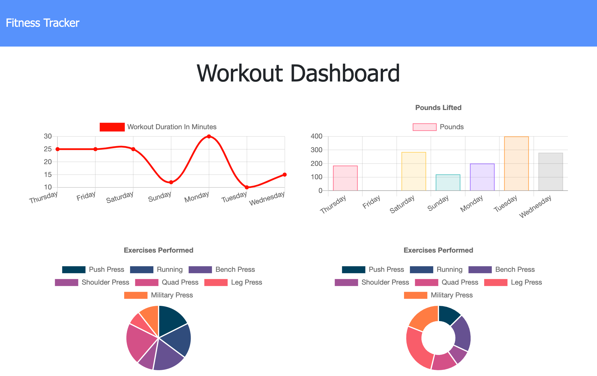

# `Fitness Tracker App`

<p align="center">
    
    
    
    <a href="https://github.com/javierperez98"></a>
</p>
<p align="center">
    
    
    
    
</p>

<a href="https://fitness-tracker-app-jp.herokuapp.com"><h1 align="center">Deployed Webpage</h1></a>

## `Description`

<!-- Provide a short description explaining the what, why, and how of your project.
What was your motivation? Why did you build this project? What problem does it solve? What did you learn? -->

- In this project I created a NOSQL database for a Fitness Tracker App using MongoDB, mongoose.js, express.js and node.js.
  This app lets you create a workout and add excersies to your workout. You can also create a new workout. It gives you an easy to use inferface to tracker all your workouts. I really enjoyed building this database and will being using MongoDB in the future.

## `Table of Contents`

- [Installation](#installation)
- [Usage](#usage)
- [Credits](#credits)
- [License](#license)
- [Questions](#questions)

## `Installation`

<!-- What are the steps required to install your project? Provide a step-by-step description of how to get the development environment running. -->

To install copy and paste either the SSH or HTTPS key and run it in either Bash (PC Users) or Terminal (MAC Users) using the git clone command.

- SSH key:

```md
git clone git@github.com:javierperez98/fitness_app.git
```

- HTTPS key:

```md
git clone https://github.com/javierperez98/fitness_app.git
```

Next you'll have to install all the required node modules by opening the index.js file using terminal/bash and typing in the following command.

```md
npm i
or
npm install
and then
npm start
```

## `Usage`

<!-- Provide instructions and examples for use. Include screenshots as needed. -->

### Homepage where you can see your most recent workout stats. You can add an excersie to your exsiting workout or create a new workout.



### When you click continue workout or create a new workout you are brought the the add exercise page. You can choose to add a cardio or resistance workout by filling out the form.



### When you click the dashboard a 7 day workout stats board is displayed for you. It displays you types of exercises, total duration and total weight.



## `Credits`

<!-- List your collaborators, if any, with links to their GitHub profiles. Links to websites or resources. -->

- https://www.google.com
- https://nodejs.org/en/docs/
- https://developer.mozilla.org/en-US/
- https://expressjs.com/
- https://www.npmjs.com/
- https://mongoosejs.com/
- https://www.mongodb.com/
- https://stackoverflow.com/
- https://mongoosejs.com/docs/guide.html#toJSON

## `License`

<!-- If you need help choosing a license, refer to https://choosealicense.com/ -->

MIT License

Copyright (c) 2021 [Javier Perez]

Permission is hereby granted, free of charge, to any person obtaining a copy
of this software and associated documentation files (the "Software"), to deal
in the Software without restriction, including without limitation the rights
to use, copy, modify, merge, publish, distribute, sublicense, and/or sell
copies of the Software, and to permit persons to whom the Software is
furnished to do so, subject to the following conditions:

The above copyright notice and this permission notice shall be included in all
copies or substantial portions of the Software.

THE SOFTWARE IS PROVIDED "AS IS", WITHOUT WARRANTY OF ANY KIND, EXPRESS OR
IMPLIED, INCLUDING BUT NOT LIMITED TO THE WARRANTIES OF MERCHANTABILITY,
FITNESS FOR A PARTICULAR PURPOSE AND NONINFRINGEMENT. IN NO EVENT SHALL THE
AUTHORS OR COPYRIGHT HOLDERS BE LIABLE FOR ANY CLAIM, DAMAGES OR OTHER
LIABILITY, WHETHER IN AN ACTION OF CONTRACT, TORT OR OTHERWISE, ARISING FROM,
OUT OF OR IN CONNECTION WITH THE SOFTWARE OR THE USE OR OTHER DEALINGS IN THE
SOFTWARE.

## `Questions`

Contact me for any questions you might have.

- GitHub: [javierperez98](https://github.com/javierperez98)
- Email: [javier21perez98@gmail.com](mailto:javier21perez98@gmail.com)
- LinkedIn: [javierperez98](https://www.linkedin.com/in/javier-perez98/)
